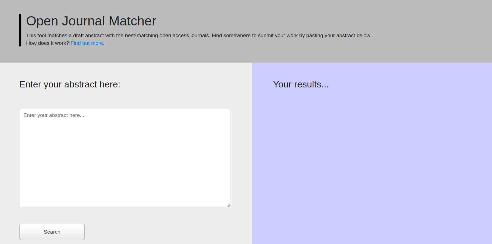

# A journal recommender tool built on the Directory of Open Access Journals

This application suggests open access journals based on their similarity to a draft abstract submitted by the user. It is meant for authors who are trying to discover suitable target journals for their work. The results are meant to be serendipitous; the goal is to uncover unexpected but relevant journals.

The application is built with Flask, combined with "serverless" infrastructure for data analysis. The Flask application calls a Google Cloud Function asynchronously. Most of the computationally intensive work is done by the Cloud Function. Specifically, the Cloud Function does similarity calculations using spaCy and returns a similarity score for each potential target journal.

Presented at:
* 18th Annual CUNY IT Conference. December 5, 2019.
* Linux Conference Australia. January 23, 2021.
* Open Science Conference. February 17, 2021.
* Electronic Resources & Libraries. March 11, 2021.

This project is partly supported by a PSC CUNY Research grant, and a grant of Google Cloud Platform credits.
